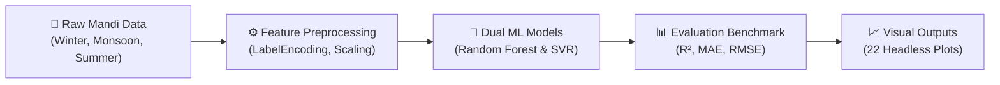

# 📊 Agricultural Price Prediction Project

<!-- markdownlint-disable MD013 MD033 -->


[;🌲+Random+Forest+Regressor+(R²+=+98.93%25)+vs+SVM+(R²+=+91.85%25);📊+Automated+Headless+Analytics+Pipeline+•+22+Visualizations;🎓+Supervised+by+Dr.+Debdutta+Pal+(Department+of+CSE);🏛️+Prepared+for+Springer+Nature+Research+Publication)](https://git.io/typing-svg)

[](https://github.com/Babin123456/ML-Based-Price-Prediction)
[](https://scikit-learn.org)
[](results/master_comparison_all.png)
[](results/master_comparison_all.png)
[](#academic-citation)
[](LICENSE)
[](https://github.com/Babin123456/ML-Based-Price-Prediction)

> [!NOTE]
> **Academic Initiative & Research Publication:**  
> This project was developed as an undergraduate **Mini Project Initiative** under the supervision and guidance of **Dr. Debdutta Pal**, Department of Computer Science & Engineering (CSE). The methodology, seasonal market findings, and machine learning models are currently being modified, extended, and prepared for research publication in a **Springer Nature** journal / proceedings.


## 📋 Project Overview

This project analyzes market prices of various agricultural commodities across India and builds predictive machine learning models to forecast **Modal Prices (₹ per Kg)** based on market and commodity characteristics such as State, District, Market, Commodity type, Variety, Grade, Minimum Price, and Maximum Price.

### Models Implemented

- **Random Forest Regressor** (`n_estimators=100`, `random_state=42`)
- **Support Vector Regressor (SVR)** (`kernel='rbf'`, `C=100.0`, `epsilon=0.1`)

### Seasonal Commodity Groups Analyzed

The project analyzes agricultural produce across three major harvest seasons:

- ❄️ **Winter Season (Babin's Dataset)**: Apple, Beetroot, Cabbage, Carrot, Cauliflower, Orange
- 🌧️ **Monsoon / Fruit Season (Liza's Dataset)**: Banana, Guava, Papaya, Peach, Plum
- ☀️ **Summer Season (Ritika's Dataset)**: Bhindi (Ladies Finger), Bitter gourd, Brinjal, Mango, Spinach
- 🇮🇳 **National Master Dataset**: Comprehensive weekly national agricultural commodity records


## 📁 Project Structure

```text
├── data/                                      # Raw CSV datasets
│   ├── Book1(Babin).csv
│   ├── Book1(Liza).csv
│   ├── Book1(Ritika).csv
│   └── Price_Agriculture_commodities_Week.csv
├── models/                                    # ML model implementations & utilities
│   ├── legacy/                                # Original member scripts
│   ├── random_forest.py                       # Random Forest Regressor module
│   ├── svm.py                                 # Support Vector Regressor module
│   └── utils.py                               # Preprocessing, metrics & plotting utilities
├── results/                                   # Saved plots & visual analytics (22 figures)
├── config.py                                  # Centralized dynamic configuration & paths
├── main.py                                    # Pipeline entry point & model comparison
├── requirements.txt                           # Project dependencies
├── LICENSE                                    # MIT Open-Source License
├── .gitignore                                 # Git ignore rules
└── README.md                                  # Documentation
```


## 🚀 Getting Started

### Prerequisites

- Python 3.8+
- pip (Python package manager)

### Installation

1. **Clone the repository:**

   ```bash
   git clone https://github.com/Babin123456/ML-Based-Price-Prediction.git
   cd ML-Based-Price-Prediction
   ```

2. **Create and activate a virtual environment (optional but recommended):**

   ```bash
   python -m venv .venv
   # Git Bash (Windows):
   source .venv/Scripts/activate

   # PowerShell (Windows):
   .venv\Scripts\Activate.ps1

   # Command Prompt (cmd.exe):
   .venv\Scripts\activate.bat

   # Linux / macOS:
   source .venv/bin/activate
   ```

3. **Install dependencies:**

   ```bash
   pip install -r requirements.txt
   ```


## 📦 Dependencies

- **pandas** - Data manipulation, CSV parsing, and aggregation
- **numpy** - Numerical operations and array indexing
- **scikit-learn** - Model training (RandomForestRegressor, SVR), scaling, and metrics
- **matplotlib** - Data plotting and dual-layer pie charts
- **seaborn** - Statistical visualizations and color palette generation


## 🔧 Usage

> [!TIP]
> **One-Click Execution:** Simply run `python main.py`. It automatically processes all three seasons (**Winter, Monsoon, and Summer**), evaluates both Random Forest and SVM on each, prints the Master Benchmark Summary, and saves all 22 figures to [`results/`](results/) in silent headless mode (no pop-up windows).

### Run the complete pipeline

```bash
python main.py
```

#### Expected Terminal Output

```text
🌱 Starting Agricultural Price Prediction Pipeline...
• Target Seasons:   Winter (Babin), Monsoon (Liza), Summer (Ritika)
• Selected Model:   Both (RF + SVM Comparison)
• Target Variable:  Modal Price
• Output Mode:      Headless saving (all figures saved to 'results/', no popup windows)

======================================================================
📂 Processing: Babin - Winter Season
📁 Source File: data\Book1(Babin).csv
======================================================================
  🌲 Random Forest Evaluation:  Complete
  🎯 SVM Evaluation:            Complete
  💾 Comparison plot saved to: results\model_comparison_babin.png

======================================================================
📂 Processing: Liza - Monsoon Season
📁 Source File: data\Book1(Liza).csv
======================================================================
  🌲 Random Forest Evaluation:  Complete
  🎯 SVM Evaluation:            Complete
  💾 Comparison plot saved to: results\model_comparison_liza.png

======================================================================
📂 Processing: Ritika - Summer Season
📁 Source File: data\Book1(Ritika).csv
======================================================================
  🌲 Random Forest Evaluation:  Complete
  🎯 SVM Evaluation:            Complete
  💾 Comparison plot saved to: results\model_comparison_ritika.png

💾 Master multi-dataset comparison plot saved to: results\master_comparison_all.png
✅ Execution completed successfully! All charts are saved under the 'results/' folder.
```

### Optional Power-User Commands

For users who want to isolate a single season or model, optional flags are supported:

| Command | Description |
| --- | --- |
| `python main.py --dataset winter` | Run on **Winter season** (Babin) only |
| `python main.py --dataset monsoon` | Run on **Monsoon season** (Liza) only |
| `python main.py --dataset summer` | Run on **Summer season** (Ritika) only |
| `python main.py --model rf` | Run **Random Forest** only across all seasons |
| `python main.py --model svm` | Run **SVM** only across all seasons |
| `python main.py --show` | Display interactive pop-up windows instead of silent saving |


## 📊 Features Used

The models predict the target price using the following feature set:

| Feature | Type | Description |
| --- | --- | --- |
| **State** | Categorical | State where the agricultural transaction occurred |
| **Market** | Categorical | Local APMC / Mandi market location |
| **Commodity** | Categorical | Specific agricultural crop/fruit/vegetable |
| **Variety** | Categorical | Specific variety or hybrid cultivar |
| **Grade** | Categorical | Quality classification grade (FAQ, Medium, etc.) |
| **Min Price** | Numerical | Minimum recorded trading price |
| **Max Price** | Numerical | Maximum recorded trading price |

**Target Variable:** `Modal Price` (₹ per Kg)


## 📈 Model Workflow



1. **Data Loading & Cleaning**:
   - Automated path resolution via `config.py` (relative paths, no broken absolute paths).
   - Missing value imputation and null handling (`dropna`).
2. **Feature Engineering & Preprocessing**:
   - Categorical columns encoded via `LabelEncoder`.
   - Feature scaling applied using `StandardScaler` on training split.
3. **Train-Test Split**:
   - 80% training data, 20% testing data (`test_size=0.2`, `random_state=42`).
4. **Model Training**:
   - Random Forest Regressor (`n_estimators=100`).
   - Support Vector Regressor (`kernel='rbf'`).
5. **Evaluation & Visualization**:
   - Evaluation metrics: $R^2$ Score, MAE, and RMSE.
   - Dual-layer visualization, trend comparison, and multi-dataset master benchmark.


## 🏆 Model Performance Comparison

Evaluated on the test split (80/20 train-test ratio) across each seasonal commodity group:

| Season & Contributor | Model | $R^2$ Score | Mean Absolute Error (MAE) | Root Mean Squared Error (RMSE) |
| :--- | :--- | :--- | :--- | :--- |
| ❄️ **Winter Season (Babin)** | **Random Forest Regressor** | **0.9799** | **₹151.88** | **₹528.73** |
| ❄️ Winter Season (Babin) | Support Vector Machine (SVM) | 0.8062 | ₹631.69 | ₹1640.37 |
| 🌧️ **Monsoon Season (Liza)** | **Random Forest Regressor** | **0.9855** | **₹74.85** | **₹195.11** |
| 🌧️ Monsoon Season (Liza) | Support Vector Machine (SVM) | 0.8295 | ₹299.14 | ₹668.26 |
| ☀️ **Summer Season (Ritika)** | **Random Forest Regressor** | **0.9893** | **₹64.04** | **₹148.67** |
| ☀️ Summer Season (Ritika) | Support Vector Machine (SVM) | 0.9185 | ₹165.56 | ₹409.86 |

> **Key Finding:** Random Forest consistently outperforms SVM across all three seasons ($R^2 \approx 98\%\text{--}99\%$), demonstrating exceptional capability in capturing non-linear relationships and supply-demand interactions across agricultural mandi markets.


## 📊 Output Visualizations Gallery

All 22 visualization figures are automatically generated in silent headless mode and saved to the [`results/`](results/) folder:

### 🌟 Master Multi-Dataset Benchmark

The 3-panel comparative performance plot comparing $R^2$, MAE, and RMSE side-by-side across all seasonal datasets:


### 🔍 Seasonal Model Comparison Charts

| ❄️ Winter Season (Babin) | 🌧️ Monsoon Season (Liza) | ☀️ Summer Season (Ritika) |
| :---: | :---: | :---: |
|  |  |  |

### 📈 Actual vs Predicted Trend Lines & Residuals

| Season | Random Forest Trend Line | Support Vector Machine Trend Line |
| :---: | :---: | :---: |
| **Winter (Babin)** |  |  |
| **Monsoon (Liza)** |  |  |
| **Summer (Ritika)** |  |  |

### 🍩 Dual-Layer Nested Donut Charts (Price Distribution)

| Season | Random Forest Dual Donut | Support Vector Machine Dual Donut |
| :---: | :---: | :---: |
| **Winter (Babin)** |  |  |
| **Monsoon (Liza)** |  |  |
| **Summer (Ritika)** |  |  |

### 📊 Commodity-Wise Price Bar Comparisons

| Season | Random Forest Grouped Bar | Support Vector Machine Grouped Bar |
| :---: | :---: | :---: |
| **Winter (Babin)** |  |  |
| **Monsoon (Liza)** |  |  |
| **Summer (Ritika)** |  |  |


## 👥 Team & Academic Supervision

- **Dr. Debdutta Pal** - Project Supervisor & Research Advisor, Department of Computer Science & Engineering (CSE)
- **Babin** - Random Forest implementation, pipeline integration, dynamic configuration & visualization
- **Liza** - Model evaluation, dataset processing & seasonal trend analysis
- **Ritika** - Support Vector Machine implementation & feature engineering


## 🐛 Troubleshooting

**Import Errors:**

```bash
pip install -r requirements.txt
```

**File Path Issues:**

- Datasets are stored in the `data/` directory.
- `config.py` automatically resolves absolute paths relative to the project root, so the project works out of the box regardless of directory location.


<a id="academic-citation"></a>

## 📄 License & Academic Citation

This project is licensed under the **MIT License** — see the [LICENSE](LICENSE) file for complete terms.

### Academic Citation

If you utilize or reference this codebase, methodology, or seasonal findings in your academic work, please cite:

```bibtex
@misc{agricultural_price_prediction_2026,
  author       = {Babin and Liza and Ritika},
  title        = {Agricultural Commodity Price Prediction across Multi-Seasonal Mandi Markets},
  year         = {2026},
  howpublished = {Undergraduate Research Project, Department of Computer Science \& Engineering},
  note         = {Supervised by Dr. Debdutta Pal. Prepared for Springer Nature publication.}
}
```


